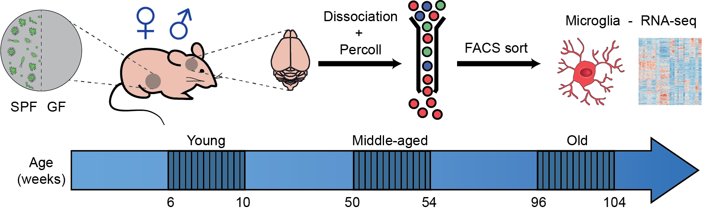

# {{ site.title }}

Microglia, the brain resident macrophages, display high plasticity in response to their environment. Aging of the central nervous system (CNS), where microglial physiology is especially disrupted, is a major risk factor for a myriad of neurodegenerative diseases. Therefore, it is crucial to decipher intrinsic and extrinsic factors, like sex and the microbiome, that potentially modulate this process.

Here, we found that **microglia follow sex-dependent dynamics in aging**. Transcriptomic profiling of microglia in females showed that microglia reach an aging-specific signature faster than males, possibly due to a dysfunction of the DNA-repair machinery. Furthermore, we identified a microglial-aging gene subset that is regulated by the gut microbiota and plays a role in microglia priming. In the absence of the gut microbiome, microglia suffered less severe aging effects by showing less lysosomal dysfunction and oxidative stress.

**On this website, you will find the details of the transcriptomic analysis done to show that the gut microbiome drives sex-biased microglial aging, but also the data for microbiota analysis.**

*This work was done by: Omar Mossad, Bérénice Batut, Bahtiyar Yilmaz, Nikolaos Dokalis, Charlotte Mezö, Lara Susann Nabavi, Melanie Mayer, Mercedes Gomez de Agüero, Andrew J. Macpherson, Stephanie C. Ganal-Vonarburg, Rolf Backofen, Daniel Erny, Marco Prinz & Thomas Blank*

## Transcriptomic analysis

### Data

{: width="60%"}

Microglia cells have been extracted from 64 mices given:
- 2 microbiota states: Conventional (SPF) and Germ free (GF)
- 3 ages: Young (8 weeks), Middle-aged (52 weeks), Old (104 weeks)
- 2 sexes: Female and Male 

Microbiota | Age | Sex | Number of samples
--- | --- | --- | --
GF | Middle-aged | Female | 6
GF | Middle-aged | Male | 4
GF | Old | Female | 3
GF | Old | Male | 5
GF | Young | Female | 5
GF | Young | Male | 4
SPF | Middle-aged | Female | 6
SPF | Middle-aged | Male | 5
SPF | Old | Female | 3
SPF | Old | Male | 13
SPF | Young | Female | 5
SPF | Young | Male | 4

Total RNA was extracted from FACS sorted CD11b+CD45lowLin- microglia cells using The ARCTURUS® PicoPure® RNA Isolation Kit (ThermoFisher) according to manufacturer’s protocol. The SMARTer Ultra Low Input RNA Kit for Sequencing v4 (Clontech Laboratories, Inc., Mountain View, CA, USA) was used to generate first strand cDNA from 500 to 750 pg total-RNA. Double stranded cDNA was amplified by LD PCR (11 cycles) and purified via magnetic bead clean-up.

Library preparation was carried out as described in the Illumina Nextera XT Sample Preparation Guide (Illumina, Inc., San Diego, CA, USA). 150 pg of input cDNA were tagmented (tagged and fragmented) by the Nextera XT transposome. The products were purified and amplified via a limited-cycle PCR program to generate multiplexed sequencing libraries. For the PCR step 1:5 dilutions of index 1 (i7) and index 2 (i5) primers were used. The libraries were quantified using the KAPA SYBR FAST ABI Prism Library Quantification Kit (Kapa Biosystems, Inc., Woburn, MA, USA). Equimolar amounts of each library were pooled, and the pools were used for cluster generation on the cBot with the Illumina TruSeq SR Cluster Kit v3.

The sequencing run was performed on a HiSeq 1000 instrument using the indexed, 50 cycles single-read (SR) protocol and the TruSeq SBS v3 Reagents according to the Illumina HiSeq 1000 System User Guide. Image analysis and base calling were converted into FASTQ files with the CASAVA1.8.2 software. Library preparation and RNAseq were performed at the Genomics Core Facility "KFB - Center of Excellence for Fluorescent Bioanalytics" (University of Regensburg, Regensburg, Germany).

### Analyses

#### Extraction of read counts of the each genes for each samples

The raw sequences in the FASTQ files were first checked for **quality** using [FastQC](https://www.bioinformatics.babraham.ac.uk/projects/fastqc/) (0.67) and cleaned and trimmed using [Trim Galore!](https://www.bioinformatics.babraham.ac.uk/projects/trim_galore/) (0.4.3). The unstrandness of the library preparations was checked for each samples using RSeQC (2.6.4, Wang2012). The sequences were then **mapped to the reference genome of mouse** (mm10 version) using STAR (2.5.2, [Dobin et al, 2012](#references)), with a gene model for splice junctions extracted for mm10 from UCSC, 100 bp for the genomic sequence around annotated junctions and other parameters set to defaults. The **number of reads mapped on genes (counts)** were extracted from the BAM files using FeatureCount (1.5.3, [Liao et al, 2013](#references)) with the annotation for mm10 from UCSC and the following parameters: exon feature file, unstranded, a minimun mapping quality per read of 12, a minimum overlap of 1bp and other parameters set to default. A [**report of the quality of each step**]({{ site.baseurl }}) was generated using MultiQC (1.5.0, [Ewels et al, 2016](#references)).

The process to extract the gene counts from FASTQ files was run on Galaxy ([Afgan et al, 2018](#references)). The full history with all steps, parameters and data can be found on [useGalaxy.eu](https://usegalaxy.eu:/u/berenice/h/amma). The downstream analyses (from counts to DEGS, modules and figures) were done with R (3.4.3) using Jupyter notebooks.

#### Preparation of the differential expression analysis

Count data was first cleaned: 3 samples with low mapping rates (< 75%) or low number and rates of reads assigned to genes (< 55%) and genes not find in any samples were removed, the genes names were checked using `rentrez` (1.2.1). The details can be found [here]({{ site.baseurl }}). 

A **differential expression analysis** was then performed with DESeq2 (1.14.1, [Love et al, 2014](#references)) with a design model integrating the different factors (sex, microbiota and age) and their interaction: `Sex + Microbiota + Age + Sex:Age + Sex:Microbiota + Microbiota:Age`. The addition of each factor and interactions were tested beforehand and the number of genes with significant adjusted p-values for the LRT (Likelihood Ratio Tests) was reported as the percentage of variables' effect on transcriptomic profile. The details of this report as well as exploratory analysis and visualization of variance stabilizing transformation of the DESeq2 model can be found [here]({{ page.dp }}/1-run_dge_analysis.html).

Normalized counts generated by DESeq2 were afterwards checked for artefacts due to FACS sorting or contamination from other cell types that may have escaped the sorting gating. The list of genes used is based on single-cell RNA-sequencing data ([Jordao2019](#references)). 3 samples and 30 markers genes of non microglia cell types were then removed.

The generated normalized counts were **clustered by samples** using hierarchical Ward clustering ([Murtagh & Legendre, 2014](#references)), implemented in the R (3.4.3) `stats` package to generate a [dendogram of the data]({{ page.dp }}/previsualization#With-all-genes)). [**Principal Components Analyses**]({{ page.dp }}/previsualization#With-all-genes#PCA-on-the-normalized-counts) were performed using the R (3.4.3) `stats` package:
1. on the full normalized counts and with several color codes to inspect the data
2. to compare the 2 microbiota states for the different combinations of age and sex.

A [**Weighted gene co-expression network analysis**]({{ page.dp }}/previsualization#Gene-co-expression-analysis) (WGCNA, [Zhang & Horvath, 2005](#references)) was performed on the normalized expression data using the R package WGCNA (1.63, [Langfelder & Horvath, 2008](#references)). For computational efficiency, genes were filtered to keep only those that have at least 10 counts in more than 90% of the samples (10,277 kept genes and 9,417 removed). The soft-thresholding power parameter was set to 6 to obtain a signed hybrid network fulfilling the scale free topology. Co-expression modules were defined using a minimum module size of 65 genes and by merging modules with a module eigengene dissimilarity below 0.35 resulting in 9 modules having sizes between 117 and 1,627 genes. A [**module-trait correlation analysis**]({{ page.dp }}/previsualization#Relationship-between-modules-and-samples) was performed between the module eigengene (ME) and the different trait (combination of microbiota, age and sex)by computing the correlation of Pearson between each pair of variables and Student asymptotic p-values for the correlations using the WGCNA package. [**SinaPlot**]({{ page.dp }}/previsualization#Sinaplots-of-the-Z-scores-per-groups) ([Sidiropoulos et al, 2018](#references)) of the mean Z-scores of genes in the different MEs were plotted using the sinaplot (1.1.0) package. A [**Gene Ontology (GO) enrichment analysis**]({{ page.dp }}/previsualization#Enrichment-analysis-in-modules) of the genes in the different MEs was performed using `goseq` (1.26.0, [Young et al, 2010](#references)), with the genome wide annotation for Mouse `org.Mm.eg.db` (3.4.0) and the Wallenius approximation. The over enriched GO categories were extracted using a 0.05 FDR cutoff ([Benjamini & Hochberg, 1995](#references)). 

Analysis | Report | Sources
--- | --- | ---
Prepare the data | [<i class="far fa-file-image"></i>]({{ site.baseurl }}) | [<i class="fab fa-github"></i>]({{ site.github.repository_url }}/tree/master/src/0-prepare_data.ipynb) 
Run Differential expression analysis | [<i class="far fa-file-image"></i>]({{ page.dp }}/1-run_dge_analysis.html) | [<i class="fab fa-github"></i>]({{ site.github.repository_url }}/tree/master/src/{{ page.dp }}/1-run_dge_analysis.ipynb) |
Previsualize the normalized count data | [<i class="far fa-file-image"></i>]({{ page.dp }}/2-previsualize_data.html) | [<i class="fab fa-github"></i>]({{ site.github.repository_url }}/tree/master/src/{{ page.dp }}/2-previsualize_data.ipynb) | [<i class="fas fa-file"></i>]({{ site.github.repository_url }}/tree/master/results/dge/{{ page.dp }}/2-previsualize_data)

#### Analyses of the differentially expressed genes given different comparisons

The differential expressed genes were identified and analyzed for different comparisons: 
- microbiota effect (GF vs SPF) for the different ages and sexes
- sex effect (Male vs Female) for the different ages and microbiota
- age effect (Middle-aged vs Young, Old vs Young and Old vs Middle-aged) for the different microbiota and sexes

These different analyses were done following the same procedure. Using the DESeq2 model, the differentially expressed genes (DEGs) showing adjusted p-values (Wald test) lower than 0.05 and absolute fold change greater than 1.5 were identified. The heatmaps for Z-scores of DEGs are plotted using `pheatmap` (1.0.8) with a hierarchical clustering of the rows (complete method). The enrichment analyses (Gene Ontology and KEGG) for the DEGs were performed using `goseq` (1.26.0, [Young et al, 2010](#references)), with the genome wide annotation for Mouse `org.Mm.eg.db` (3.4.0) and the Wallenius approximation. The over and under enriched categories were extracted using a 0.05 FDR cutoff ([Benjamini & Hochberg, 1995](#references)). Networks of GO terms were generated using `RamiGO` (1.20.0, [Schröder et al, 2013](#references)) and the KEGG pathways using `pathview` (1.14.0, [Luo & Brouwer, 2013](#references)).

Analysis | Report | Sources | Data & Results
--- | --- | --- | ---
Compare the microbiota (GF vs SPF) for the different ages and sexes | [<i class="far fa-file-image"></i>]({{ page.dp }}/3-analyze_microbiota_effect_given_ages_sexes.html) | [<i class="fab fa-github"></i>]({{ site.github.repository_url }}/tree/master/src/{{ page.dp }}/3-analyze_microbiota_effect_given_ages_sexes.ipynb) | [<i class="fas fa-file"></i>]({{ site.github.repository_url }}/tree/master/results/dge/{{ page.dp }}/3-analyze_microbiota_effect_given_ages_sexes)
Compare the sexes (Male vs Female) for the different ages and microbiota | [<i class="far fa-file-image"></i>]({{ page.dp }}/4-analyze_sex_effect_given_ages_microbiota.html) | [<i class="fab fa-github"></i>]({{ site.github.repository_url }}/tree/master/src/{{ page.dp }}/4-analyze_sex_effect_given_ages_microbiota.ipynb) | [<i class="fas fa-file"></i>]({{ site.github.repository_url }}/tree/master/results/dge/{{ page.dp }}/4-analyze_sex_effect_given_ages_microbiota)
Compare the ages (Middle-aged vs Young, Old vs Young and Old vs Middle-aged) for the different microbiota and sexes | [<i class="far fa-file-image"></i>]({{ page.dp }}/5-analyze_age_effect_given_microbiota_sexes.html) | [<i class="fab fa-github"></i>]({{ site.github.repository_url }}/tree/master/src/{{ page.dp }}/5-analyze_age_effect_given_microbiota_sexes.ipynb) | [<i class="fas fa-file"></i>]({{ site.github.repository_url }}/tree/master/results/dge/{{ page.dp }}/5-analyze_age_effect_given_microbiota_sexes)

#### Extra analyses

Analysis | Report | Sources | Data & Results
--- | --- | --- | ---
Study of CML effect | [<i class="far fa-file-image"></i>]({{ page.dp }}/6-analyze_cml_effect.html) | [<i class="fab fa-github"></i>]({{ site.github.repository_url }}/tree/master/src/{{ page.dp }}/6-analyze_cml_effect.ipynb) | [<i class="fas fa-file"></i>]({{ site.github.repository_url }}/tree/master/results/dge/{{ page.dp }}/6-analyze_cml_effect)
Postvisualize | [<i class="far fa-file-image"></i>]({{ page.dp }}/7-postvisualize.html) | [<i class="fab fa-github"></i>]({{ site.github.repository_url }}/tree/master/src/{{ page.dp }}/7-postvisualize.ipynb) | [<i class="fas fa-file"></i>]({{ site.github.repository_url }}/tree/master/results/dge/{{ page.dp }}/7-postvisualize)

## Microbiota analysis

Since we observed different microglial-aging dynamics in the absence of the microbiota, we sought to investigate the age-dependent gut microbiota alterations in female and male mice. The gut microbiota of 44 individual samples were characterized by sequencing the V5-V6 region of the bacterial 16S rRNA gene.

### Data

Fecal samples were collected into 2ml microfuge tubes and stored at -20°C prior to DNA extraction protocol. Total DNA was isolated from samples using the QIAamp DNA stool kit (Qiagen) according to the modified manufacturer’s instructions. Briefly, 100-200 mg pellets were homogenized in 500μl Buffer ASL buffer by bead-beating step using tissue lyzer for 3min at 30Hz and with two additional a 95°C lysis steps. Afterwards, samples were incubated with 200μl Lysis Buffer for Gram+ (20mg/ml lysozyme (Sigma); 20mM Tris-HCl, pH 8.0; 2mM EDTA; 1.2% Triton, autoclaved (Sigma-Aldrich) treatment. Following that, manufacturer’s protocol was continued. Total DNA was eluted in 30μl RNase-free water. DNA concentration was assessed using Nanodrop (Thermo Fisher Scientific) and samples were stored in -20°C until amplicon PCR. The fecal microbiota of IBD patients was analyzed by 16S rRNA amplicon sequencing on the lonTorrent PGMTM platform, as previously described. DNA was pooled at a concentration of 26 pM and the pooled library was sequenced for the V5/ V6 region of 16S rRNA genes in an IonTorrent PGM system according to the manufacturer’s instructions (Thermo Fisher Scientific)

The sequencing fasta file will be available on ENA soon and corresponding mapping file can be found [here]({{ site.github.repository_url }}/tree/master/data/16s_mapping.txt).

### Microbial profiling data analysis

A total of 2,560,003 high-quality reads were obtained with a mean of 38,209 reads per subject. Reads were clustered in 65,878 operational taxonomic units at 97% of identity.

Data was further analyzed using QIIME v1.9.1 pipeline after filtering out low quality (accuracy of base calling; q<25) samples and samples with more than 4,500 reads were retained for further analysis ([Caporaso et al, 2010](#references)). Operational taxonomic units (OTUs) were picked using UCLUST with a 97% sequence identity threshold followed by taxonomy assignment using the latest GreenGenes database from May 2013 ([DeSantis et al., 2006](#references)). Alpha and beta diversity were calculated using the phyloseq pipeline in R (v3.4) ([Callahan et al., 2016; McMurdie and Holmes, 2012](#references)) and correlations between alpha diversity and anxiety or depression values were tested using non-parametric Spearman correlation with 95% confidence interval. We used the non-parametric Mann-Whitney U-tests to compare alpha diversity between samples and Adonis from vegan package to assess the effects of groups for beta diversity via phyloseq in R ([Callahan et al., 2016; McMurdie and Holmes, 2012](#references)). Taxonomic differences at phylum and genus levels between tested groups were identified using the “multivariate analysis by linear models” (MaAsLin) R package ([Morgan et al., 2012](#references)). The prediction of metagenome functional content was performed using 16S sequencing data in Phylogenetic Investigation of Communities by Reconstruction of Unobserved States (PICRUSt) pipeline ([Langille et al., 2013](#references)).  PICRUSt predictions were categorized as levels 1–3 into Kyoto Encyclopedia of Genes and Genomes pathways. Plots were generated with ggplot2 using a phyloseq object in R ([McMurdie and Holmes, 2013](#references)). Only taxa present in at least 30% of samples and OTUs comprising more than 0.0001% of total counts were considered. A p< 0.05 and a false discovery rate (FDR; Benjamini-Hochberg correction) of q < 0.05 were used as cut-off values for significance. Taxonomy data were further plotted in GraphPad Prism (GraphPad Software, Version 7.0) and two way-ANOVA followed by FDR test (two-stage step-up method of Benjamini, Krieger and Yetkutieli) was used. Differences were considered significant when P value <0.05.

## References

- Afgan, E., Baker, D., Batut, B., Van Den Beek, M., Bouvier, D., Čech, M., ... & Guerler, A. (2018). The Galaxy platform for accessible, reproducible and collaborative biomedical analyses: 2018 update. Nucleic acids research, 46(W1), W537-W544.
- Benjamini, Y., & Hochberg, Y. (1995). Controlling the false discovery rate: a practical and powerful approach to multiple testing. Journal of the Royal statistical society: series B (Methodological), 57(1), 289-300.
- Callahan, B. J., McMurdie, P. J., Rosen, M. J., Han, A. W., Johnson, A. J. A., & Holmes, S. P. (2016). DADA2: high-resolution sample inference from Illumina amplicon data. Nature methods, 13(7), 581.
- Caporaso, J. G., Kuczynski, J., Stombaugh, J., Bittinger, K., Bushman, F. D., Costello, E. K., ... & Huttley, G. A. (2010). QIIME allows analysis of high-throughput community sequencing data. Nature methods, 7(5), 335.
- DeSantis, T. Z., Hugenholtz, P., Larsen, N., Rojas, M., Brodie, E. L., Keller, K., ... & Andersen, G. L. (2006). Greengenes, a chimera-checked 16S rRNA gene database and workbench compatible with ARB. Appl. Environ. Microbiol., 72(7), 5069-5072.
- Dobin, A., Davis, C. A., Schlesinger, F., Drenkow, J., Zaleski, C., Jha, S., ... & Gingeras, T. R. (2013). STAR: ultrafast universal RNA-seq aligner. Bioinformatics, 29(1), 15-21.
- Ewels, P., Magnusson, M., Lundin, S., & Käller, M. (2016). MultiQC: summarize analysis results for multiple tools and samples in a single report. Bioinformatics, 32(19), 3047-3048.
- Jordão, M. J. C., Sankowski, R., Brendecke, S. M., Locatelli, G., Tai, Y. H., Tay, T. L., ... & Mai, D. (2019). Single-cell profiling identifies myeloid cell subsets with distinct fates during neuroinflammation. Science, 363(6425), eaat7554.
- Langfelder, P., & Horvath, S. (2008). WGCNA: an R package for weighted correlation network analysis. BMC bioinformatics, 9(1), 559.
- Liao, Y., Smyth, G. K., & Shi, W. (2013). featureCounts: an efficient general purpose program for assigning sequence reads to genomic features. Bioinformatics, 30(7), 923-930.
- Love, M. I., Huber, W., & Anders, S. (2014). Moderated estimation of fold change and dispersion for RNA-seq data with DESeq2. Genome biology, 15(12), 550.
- Luo, W., & Brouwer, C. (2013). Pathview: an R/Bioconductor package for pathway-based data integration and visualization. Bioinformatics, 29(14), 1830-1831.
- McMurdie, P. J., & Holmes, S. (2012). Phyloseq: a bioconductor package for handling and analysis of high-throughput phylogenetic sequence data. In Biocomputing 2012 (pp. 235-246).
- McMurdie, P. J., & Holmes, S. (2013). phyloseq: an R package for reproducible interactive analysis and graphics of microbiome census data. PloS one, 8(4), e61217.
- Morgan, X. C., Tickle, T. L., Sokol, H., Gevers, D., Devaney, K. L., Ward, D. V., ... & Bousvaros, A. (2012). Dysfunction of the intestinal microbiome in inflammatory bowel disease and treatment. Genome biology, 13(9), R79.
- Murtagh, F., & Legendre, P. (2014). Ward’s hierarchical agglomerative clustering method: which algorithms implement Ward’s criterion?. Journal of classification, 31(3), 274-295.
- Schröder, M. S., Gusenleitner, D., Quackenbush, J., Culhane, A. C., & Haibe-Kains, B. (2013). RamiGO: an R/Bioconductor package providing an AmiGO visualize interface. Bioinformatics, 29(5), 666-668.
- Sidiropoulos, N., Sohi, S. H., Pedersen, T. L., Porse, B. T., Winther, O., Rapin, N., & Bagger, F. O. (2018). SinaPlot: an enhanced chart for simple and truthful representation of single observations over multiple classes. Journal of Computational and Graphical Statistics, 27(3), 673-676.
- Wang, L., Wang, S., & Li, W. (2012). RSeQC: quality control of RNA-seq experiments. Bioinformatics, 28(16), 2184-2185.
- Young, M. D., Wakefield, M. J., Smyth, G. K., & Oshlack, A. (2010). Gene ontology analysis for RNA-seq: accounting for selection bias. Genome biology, 11(2), R14.
- Zhang, B., & Horvath, S. (2005). A general framework for weighted gene co-expression network analysis. Statistical applications in genetics and molecular biology, 4(1).
